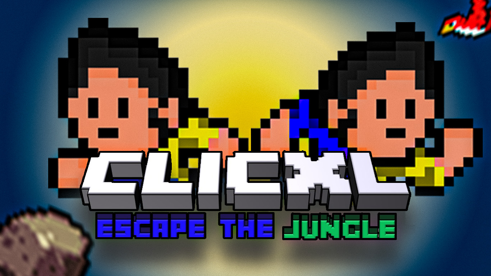

<h1> Clicx: Escape The Jungle</h1>

Clicxl is a dodge-the-obstacle type game made with **pygame** a python module which allows to create 2D 3D games.

⚠️ Clicxl has been designed recently and this will be the game first versions. You may run into minor graphical issues or crashes or musical errors while using it. *Please Cooperate*.
*** 
## Setup And Running

### Manual installation (recommended)
Your will need [**Python**](https://www.python.org/) and [**Pygame**](https://www.pygame.org/news) to be able to play the game.

##### Stable releases
The latest releases of Clicxl are published to our GitHub release pages. Releases are considered by our team to be **suitable for general use**, but they are not guaranteed to be free of bugs and other issues.

Usually, releases will be made available on GitHub slightly sooner than other locations.

##### Bleeding-edge builds (unstable)
If you are a player who is looking to get your hands on the latest**bleeding-edge changes for testing**, then you might consider to look into our snapshots version.

Bleeding edge builds will often include unfinished code that hasn't been extensively tested. That code may introduce incomplete features, bugs, crashes, and all other kinds of weird issues. You **should not use these bleeding edge builds** unless you know what you are doing and are comfortable with software debugging. If you report issues using these builds, we will expect that this is the case.
***
#### Reporting Issues
You can report bugs and crashes by opening an issue on our [issue tracker](https://github.com/Clicxl/Clicxl-Escape-the-Jungle/issues). Before opening a new issue, use the search tool to make sure that your issue has not already been reported and ensure that you have completely filled out the issue template. Issues that are duplicates or do not contain the necessary information to triage and debug may be closed.

Please note that while the issue tracker is open to feature requests, development is primarily focused on improving hardware compatibility, performance, and finishing any unimplemented features necessary for parity with the vanilla renderer.

***
## License
Clicxl: Escape the Jungle is licensed under GNU LGPLv3, a free and open-source license. For more information, please see the [license file](https://github.com/Clicxl/Clicxl-Escape-the-Jungle/blob/main/LICENSE.md).
